# Google Data Analytics Capstone Project
**Professional Certificate:** [Google Data Analytics](https://www.coursera.org/professional-certificates/google-data-analytics)

**Course:** [Google Data Analytics Capstone: Complete a Case Study](https://www.coursera.org/learn/google-data-analytics-capstone)

[Verify Credential](https://www.coursera.org/account/accomplishments/specialization/W5Q2JUWN8S5D)

## Introduction
In this capstone project, I will be answering the key business question using the steps of the data analysis process: [Ask](#ask), [Prepare](#prepare), [Process](#process), [Analyze](#analyse), [Share](#share), [Act](#act) where each of these steps will include certain deliverables that will together form up the final report.

I will be making use of **MySQL** for data preparation and analysis before making use of **Tableau** for data visualisation. 

## Background

### About the Company
In 2016, Cyclistic launched a successful bike-share offering. Since then, the program has grown to a feet of 5,824 bicycles that are geotracked and locked into a network of 692 stations across Chicago. The bikes can be unlocked from one station and returned to any other station in the system anytime.
Until now, Cyclistic’s marketing strategy relied on building general awareness and appealing to broad consumer segments. One approach that helped make these things possible was the flexibility of its pricing plans: single-ride passes, full-day passes, and annual memberships. Customers who purchase single-ride or full-day passes are referred to as casual riders. Customers who purchase annual memberships are Cyclistic members.
Cyclistic’s finance analysts have concluded that annual members are much more profitable than casual riders. Although the pricing flexibility helps Cyclistic attract more customers, Moreno believes that maximizing the number of annual members will be key to future growth. Rather than creating a marketing campaign that targets all-new customers, Moreno believes there is a solid opportunity to convert casual riders into members. She notes that casual riders are already aware of the Cyclistic program and have chosen Cyclistic for their mobility needs.
Moreno, the director of marketing and our manager has set a clear goal: Design marketing strategies aimed at converting casual riders into annual members. In order to do that, however, the team needs to better understand how annual members and casual riders differ, why casual riders would buy a membership, and how digital media could affect their marketing tactics. Moreno and her team are interested in analyzing the Cyclistic historical bike trip data to identify trends.

### Scenario
You are a junior data analyst working on the marketing analyst team at Cyclistic, a bike-share company in Chicago. The director of marketing believes the company’s future success depends on maximizing the number of annual memberships. Therefore, your team wants to understand how casual riders and annual members use Cyclistic bikes differently. From these insights, your team will design a new marketing strategy to convert casual riders into annual members. But frst, Cyclistic executives must approve your recommendations, so they must be backed up with compelling data insights and professional data visualizations.

## Ask

### Deliverable
1. A clear statement of the business task

### Business Task
Devise marketing strategies to convert casual riders to members.

### Analysis Questions
Three questions will guide the future marketing program:
1. How do annual members and casual riders use Cyclistic bikes differently?
2. Why would casual riders buy Cyclistic annual memberships?
3. How can Cyclistic use digital media to influence casual riders to become members?

Moreno has assigned you the first question to answer: 
**How do annual members and casual riders use Cyclistic bikes differently?**

## Prepare

### Deliverable
A description of all data sources used

### Data Source
I will be using Cyclistic’s historical trip data to analyze and identify trends which can be downloaded [here](https://divvy-tripdata.s3.amazonaws.com/index.html). I will be making use of the data from Jan 2023 - Dec 2023 (Accessed May 2024).

The data has been made available by Motivate International Inc. under this [license](https://divvybikes.com/data-license-agreement).

This is public data that we can use to explore how different customer types are using Cyclistic bikes. But note that data-privacy issues prohibit you from using riders’ personally identifiable information. This means that you won’t be able to connect pass purchases to credit card numbers to determine if casual riders live in the Cyclistic service area or if they have purchased multiple single passes.

### Data Organisation
There are 12 files with naming convention of YYYYMM-divvy-tripdata and each file includes information for one month, such as the ride id, bike type, start time, end time, start station, end station, start location, end location, and whether the rider is a member or not. The corresponding column names are `ride_id`, `rideable_type`, `started_at`, `ended_at`, `start_station_name`, `start_station_id`, `end_station_name`, `end_station_id`, `start_lat`, `start_lng`, `end_lat`, `end_lng` and `member_casual`.

## Process

### Deliverable
Documentation of any cleaning or manipulation of data

### Data Loading
SQL Script: `data_loading.sql`

Created a schema which consists of 12 tables, each table representing one month of trip data. This is the very first step before we can begin our analysis using MySQL.

### Data Combining
SQL Script: `data_combining.sql`

Created a new table `combined_trip_data`, combining all 12 months trip data. Having an combined table allows us to perform queries easier.

### Data Exploration
SQL Script: `data_exploration.sql`

Before cleaning the data, we can explore the current data to find any inconsistencies that needs to be addressed. Here are some observations:

1. There is a total of 5719865 rows of data.
 
2. The table all the 13 columns and their respective data type. The primary key is the `ride_id` column. 

    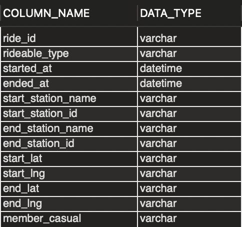

3. The table belows shows the number of missing records. We will have to remove these rows in our data cleaning phase so that it will not affect our analysis
    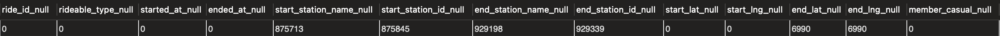

4. There are no duplicates rows in the data

5. There are 1269 records where the difference in starting time and ending time is less than or equals to 0. If the difference is less than 0, this is likely to be an data collection error as ending time should always be greater to or equal starting time, it cannot be before starting time! If the difference is 0, this data is not very relevant as it is likely that the user did not plan to make the trip. We need to remove these data in our data cleaning phase to prevent such errors from affecting our analysis.

6. There are 3 unique type of bikes in our data - electric, classic and docked

    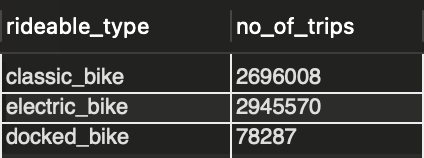

7. There is only 2 type of membership status in our data - member and casual

    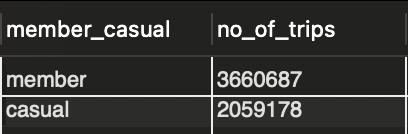

8. We can make use of the `started_at` and `ended_at` column to create a new column `ride_length` which can tell us more about the duration of each ride which will be a more useful information. 

9. We can also create a column make use of the `started_at` and `ended_at` column to create a new column `day_of_week`, `hour_of_day`, `month_of_year` and calculate the day of the week, hours of the day and month of the year that each ride started which can reveal more about which days are preferred by users.

### Data Cleaning
SQL Script: `data_cleaning.sql`

Below is the summary of the data cleaning performed:

1. Removed the rows with missing values
2. Created the new columns `ride_length` `day_of_week`, `hour_of_day` and `month_of_year`
3. Removed the rows where `ride_length` is less than or equals to 0

Sample of the finalised cleaned data with 4331130 rows:

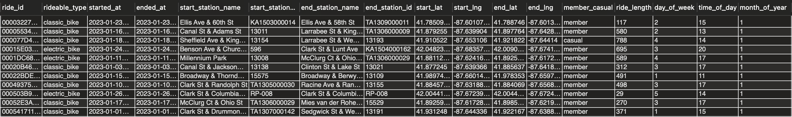

## Analyse and Share

### Deliverable
1. A summary of your analysis
2. Supporting visualizations and key findings

### Data Analysis
SQL Script: `data_analysis.sql`

Below is the summary of the data analysis performed:

1. Find the usage of each bike type for each rider type.

    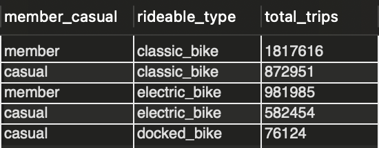

2. Find the descriptive statistics of ride duration for each bike type and rider type.
    
    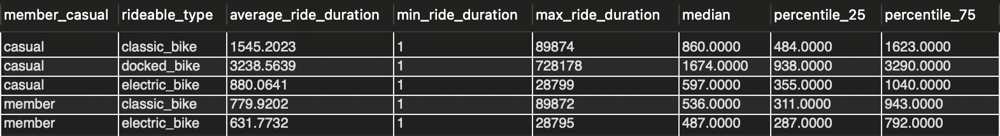  

3. Find the no. of trips by hour, day and month.

    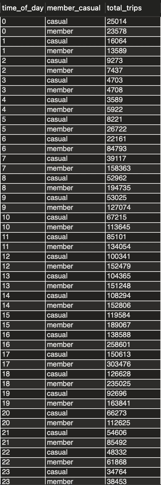

    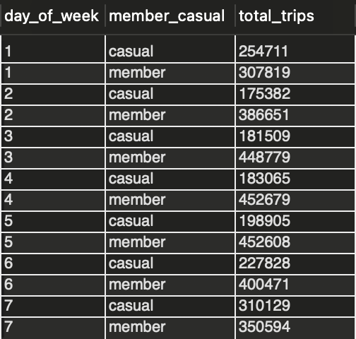

    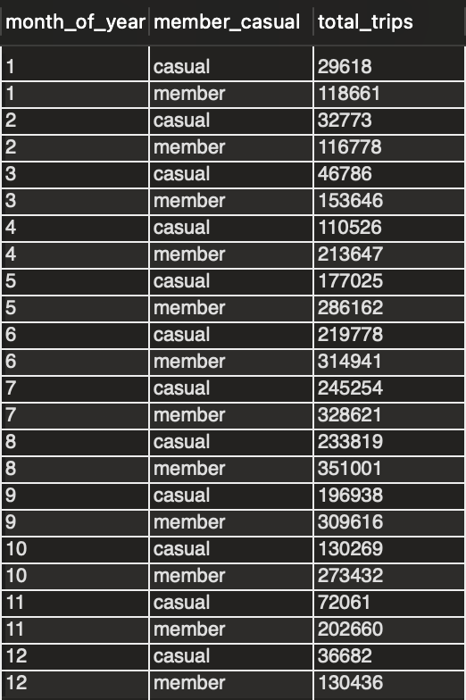

4. Find the average ride duration by hour, day and month.

    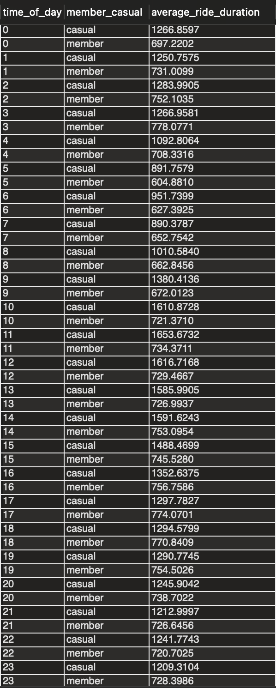

    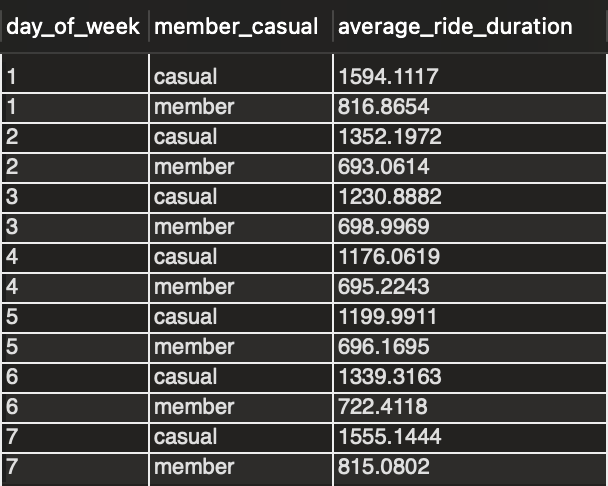

    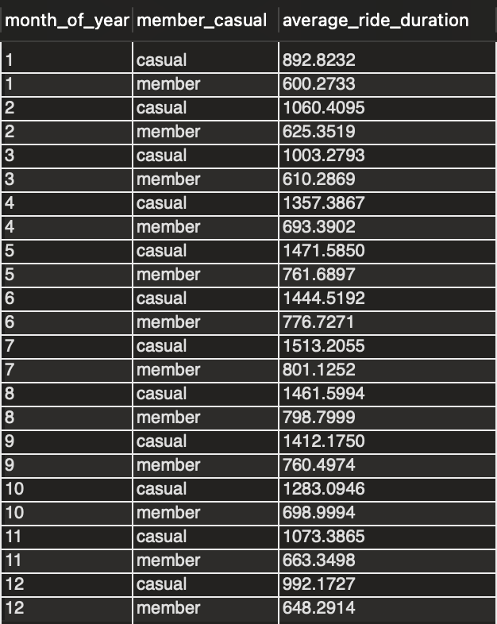

5. Find the no. of trips for the different starting and ending locations

    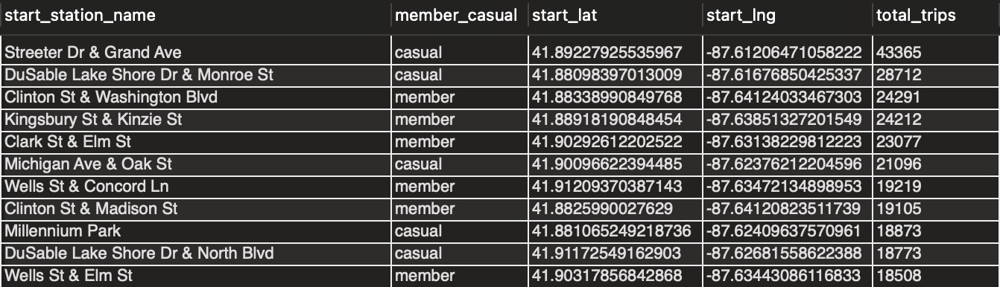

    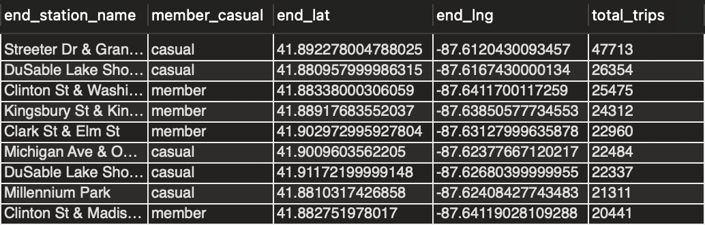

### Data Visualisation and Key Findings

**Key Question: How do annual members and casual riders use Cyclistic bikes differently?**

Below is the screenshot of the overall dashboard that was created using Tableau, visualising all of the key insights.

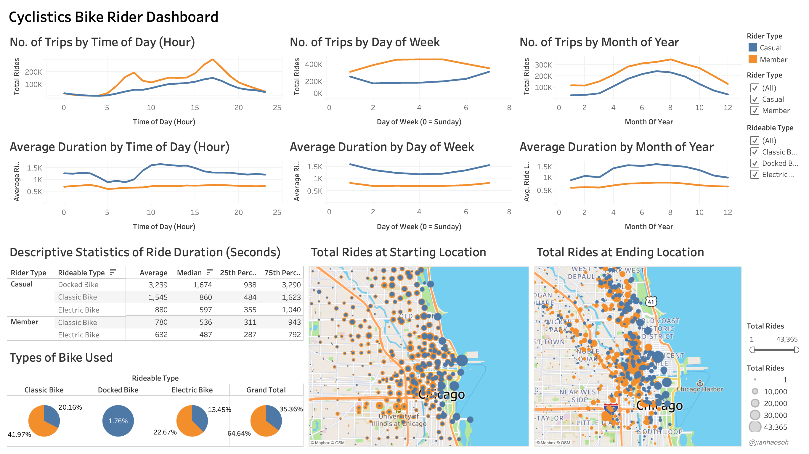 

These are the key findings:

1. From the type of bikes being used, we see that member riders make up approximately 64% of the total rides while casual riders make up the rest of the 36%, thus showing that member riders actually make more rides compared to casual riders. Additionally, we can see that classic bikes are the most popular bike type, contributing to 61% of total rides. The least popular bike type is the docked bikes which only contributed to 1.7% of the total rides and that none of the member riders used the docked bikes. 

    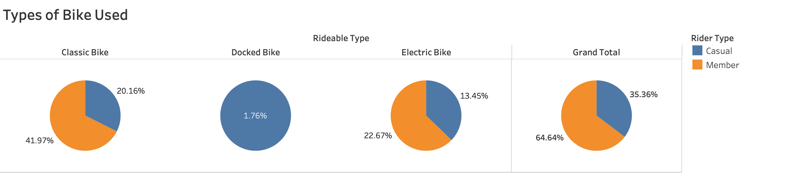 

2. Looking at the number of trips by time, day and month, we can generate some insights and understand the usage patterns and differences in frequency between member and casual riders. 

    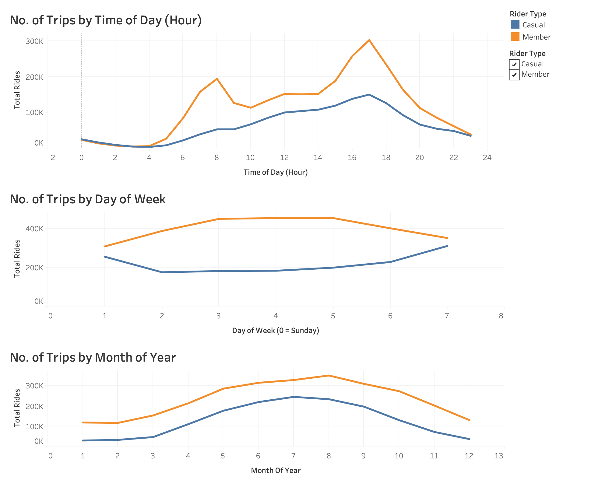 

    Firstly, from the time of day information, for both member and casual riders, the general trend shows that there is an increase in usage at the start of the day from 4am all the way till 6pm before we start seeing a decline in usage heading towards 11pm. This makes sense since most riders will typically use the bike services as they are carrying out their day to day activities outside and will not be using the bikes when they are at home. For member riders, there is two significant peak at 8 AM and 5 PM while for casual riders, the usage pattern is more evenly distributed throughout the day, with no significant peaks. This makes senses as 8 AM and 5 PM correspond to the typical workday schedule, where people start their workday around 9 AM and end at 5 PM. Thus it is likely that this increased in usage by members is due to them commuting to and from work. While for casual riders, it also suggest that they do not have a fixed routine of when they use the bikes.

    Next, from the day of week information, we notice that member riders typically use the bikes more on weekdays compared to weekends while casual riders typically use the bikes on weekends compared to weekdays.  This further support the idea that member riders are using it the bikes to commute to their work during the weekdays. The dip in usage over the weekend supports the idea that member riders rely on the bikes for practical, routine tasks during the workweek. While for casual riders,increased usage on weekends aligns with them using it for recreational or leisure activities that have no fixed schedule.

    Lastly, from the month of year information, both member and casual riders follow a similar trend where there is an increase in usage during the spring and summer and fewer usage in the winter. This makes sense since it might be less feasible for users to cycle during the winter season.

3. Looking at the average ride duration by time, day and month, this can help us further understand the usage patterns of both member and casual riders and from there derive their use case.  

    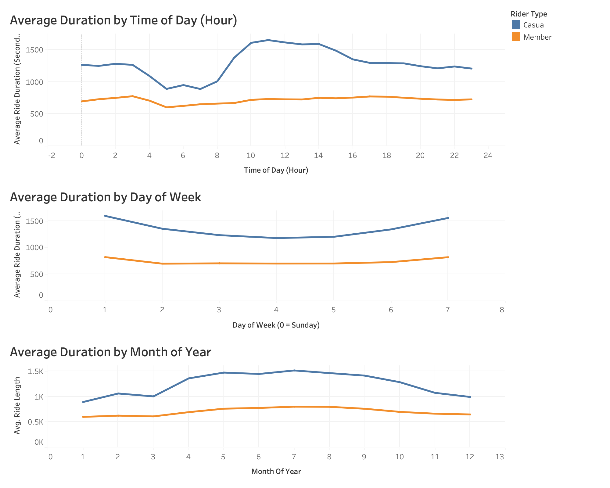 

    Overall, we notice that generally, for member riders, the average usage duration is evenly distributed throughout the time of day, day of week and month of year and it is also lower compared to casual riders. This supports the argument that member riders are likely only using the bikes as part of their routine, thus there will be lesser variation in duration used across different periods. It also makes sense for their usage duration to be lower than casual riders, as members are likely to use bikes for shorter, predictable trips, such as commuting distances that are feasible for biking. Membership likely appeals to regular users who value convenience and cost-effectiveness for such short trips. Casual users generally have greater variablity in average duration and higher average duration. This is likely due to the fact that each rider is using the bike for varying purposes thus seeing the greater variability and that the higher duration could be due to recreational or leisure use, where casual riders are less concerned about time constraints and more about enjoying their ride. 

    There is also a similar trend where average duration cycled by casual riders is higher during the weekends and lower during the winter season. For member riders, this duration stays relatively constant throughout.

4. Lastly, we can look at the total rides from the starting and ending locations of both member and casual riders. This can help us to see where do the riders commute to and from which can help us identify their use case. I filtered the data to show the locations where there are more than 15000 rides to identify the high traffic areas and to reduce the number of data points in order to better discern patterns.

    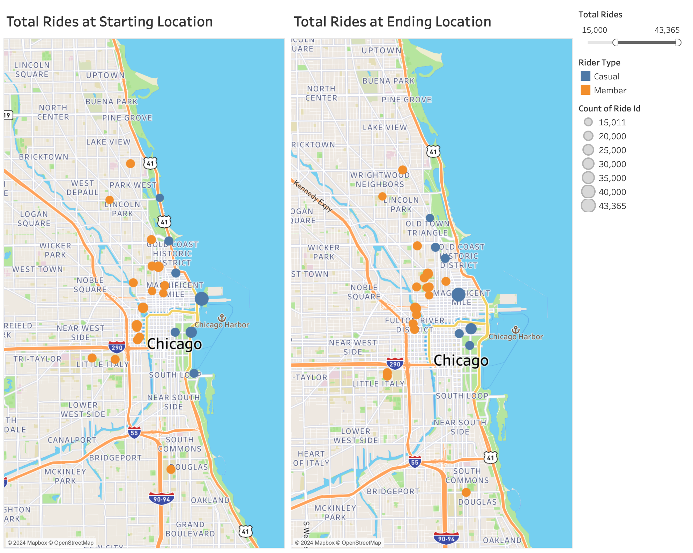 

    Overall, we notice that generally, for casual riders, their starting points tend to be concentrated near coastal areas, including beaches, parks, and harbor points and the ending points tend to be moving inwards away from coastal areas but still at areas where there are recreational activities like parks. This could be due to limited public transportation options in those areas and that they could be using the bikes for recreational activities, such as sightseeing or exploration, which begin near popular outdoor destinations and end elsewhere. For member riders, their starting points are mostly located near residential areas, universities, offices and other places where people begin their daily activities. Their ending points are also concentrated near these areas which sugges that they mainly use thes bikes for commuting purposes for short, routine trips within familiar areas.

### Summary of Findings for Casual and Member Riders
|Casual|Member|
|------|------|
|Use bikes throughout the day and more often during the weekends|Use bikes during commute hours (8AM / 5PM) during weekdays|
|Travel for longer duration but less frequently than members|Travel for shorter duration but more frequently than casual|
|Start and end their rides near recreational sites and places with limited transport options|Start and end their rides close to residential, schools and commercial areas|
|Typical use case is for occasional leisure purposes|Typical use case is for short distance commuting purposes as part of their routine transportation needs| 

## Act

### Deliverable
Your top three recommendations based on your analysis

### Recommendations
After identifying the key differences in use case for casual and member riders, here are some recommended marketing strategies to convert casual riders to members.

1. Since casual riders typically use the bikes for recreational activities that often takes place during the weekend, we can offer weekend-only memberships to attact the casual riders to sign up for a membership.
2. Since casual riders typically travel for longer durations, we can increase the price for the per minute usage for casual riders or alternatively offer discounts for longer duration travel for member riders such that this will incentivise casual users to sign up for an membership for a cheaper price of travelling for longer duration.
3. Since casual riders typically travel at recreational sites or areas near the coastal area without other form of transportation, we can introduce a bike that is only available for usage by members and place them at these areas. Thus, users that want to travel within these recreational areas will have no choice but to sign up as a member rider.
